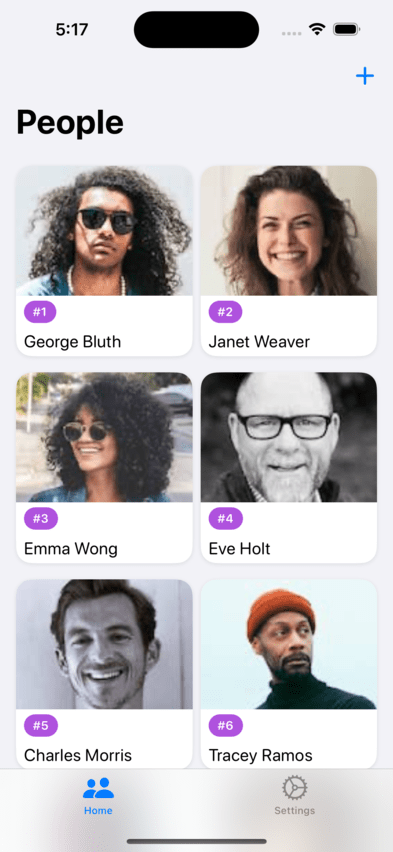
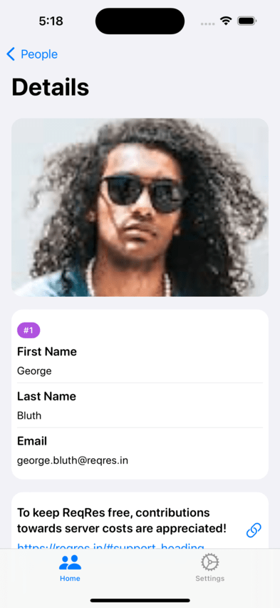
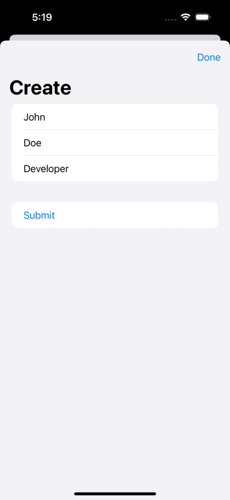
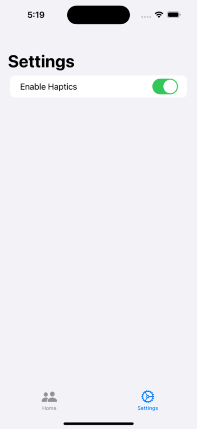

# iOSTakeHomeProject

## Overview

**iOSTakeHomeProject** is a sophisticated iOS application developed using SwiftUI, following the MVVM (Model-View-ViewModel) architecture pattern. It leverages Swift Concurrency to provide a responsive and efficient user experience while utilizing the [Reqres.in API](https://reqres.in) for data retrieval. The app not only adheres to Apple's Human Interface Guidelines but also adds an extra layer of visual appeal through animations. It offers comprehensive CRUD (Create, Read, Update, Delete) functionality for managing data seamlessly. Additionally, it implements infinite scrolling for efficient data exploration, utilizes haptic feedback for a tactile experience, and includes robust error handling to ensure a smooth user experience. Furthermore, it supports both light and dark themes to cater to users' preferences. To maintain code quality and reliability, the app also includes a suite of unit and UI tests.

## Features

- **Stunning User Interface**: The app's UI design is in harmony with Apple's Human Interface Guidelines, ensuring an aesthetically pleasing and intuitive user experience. 🎨

- **Swift Concurrency**: Utilizes Swift Concurrency to provide a responsive and efficient user interface, enhancing overall performance. 🚀

- **Reqres.in API Integration**: Connects to the [Reqres.in API](https://reqres.in) to retrieve and manage data seamlessly within the app. 🌐

- **Smooth Animations**: Enjoy fluid animations throughout the app, adding a touch of elegance and interactivity to your interactions. 🎉

- **CRUD Functionality**: Full CRUD support allows users to effortlessly create, read, update, and delete data entries, simplifying data management tasks. ✏️

- **Infinite Scrolling**: Seamlessly explore large datasets with infinite scrolling, offering a convenient and efficient way to access content. 🔄

- **Haptic Feedback**: The app incorporates haptic feedback to provide tactile responses and enhance the user experience. 📳

- **Robust Error Handling**: Comprehensive error handling ensures that users receive clear and informative messages when issues arise, minimizing user frustration. 🛠️

- **Light & Dark Theme**: Choose between light and dark themes to match your preferred visual style and optimize readability in different lighting conditions. 🌞🌚

- **Testing**: The app includes a comprehensive suite of unit and UI tests to maintain code quality and reliability, ensuring a stable user experience. ✔️

## Screenshots

## Getting Started

1. Clone this repository to your local machine.

2. Open the Xcode project.

3. Build and run the app on your iOS device or simulator.

## Usage

1. Launch the app.

2. Explore the beautiful user interface.

3. Use CRUD functionality to manage data.

4. Experience the smooth animations and haptic feedback.

5. Toggle between light and dark themes in the app settings.

6. Enjoy efficient data exploration with infinite scrolling.

## Testing

To run the tests, follow these steps:

1. Open the Xcode project.

2. Navigate to the test target.

3. Run the unit and UI tests to ensure code quality and reliability.

## License

This project is licensed under the MIT License. See the [LICENSE](LICENSE) file for details.

## Contact

If you have any questions, suggestions, or feedback, please don't hesitate to reach out:

- Email: ✉️ [saeedsaleem.04@gmail.com](mailto:saeedsaleem.04@gmail.com)
- Linkedin: 💼 [Muhammad Saeed](https://www.linkedin.com/in/muhammad-saeed-569527204)
- Twitter: 🐦 [@itssaeed592](https://twitter.com/itssaeed592) 
- GitHub: 👨‍💻 [muhammadsaeed05](https://github.com/muhammadsaeed05)

Thank you for using iOSTakeHomeProject - your elegant and feature-rich iOS companion.
